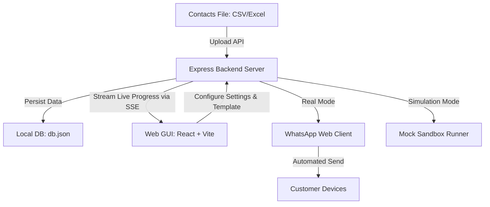

# 🚀 ColdReach: WhatsApp Outreach & Campaign Manager

[](https://opensource.org/licenses/MIT)
[](https://nodejs.org/)
[](https://react.dev/)
[](https://vitejs.dev/)

ColdReach is a premium, lightweight, self-hosted bulk WhatsApp outreach platform. It enables businesses and developers to run automated messaging campaigns using WhatsApp Web integration. With spreadsheet parsing, dynamic templates, safety delays, and real-time execution tracking, ColdReach streamlines cold messaging workflows efficiently.

---

## 🛠️ System Architecture & Workflow



---

## ✨ Key Features

- **Device Synchronization (QR Code)**: Direct connection to WhatsApp Web using `whatsapp-web.js` through an embedded, interactive QR code.
- **Flexible Outreach Modes**:
  - **Real Mode**: Sends actual messages via Puppeteer-automated browser sessions.
  - **Simulation Mode**: Dry-run campaigns with custom delivery success ratios to test scripts and templates safely.
- **Spreadsheet Auto-Normalization**: Parses and normalizes headers for CSV and Excel files (e.g. mapping `Phone`, `owner name`, `business` to standard formats).
- **Dynamic Template Engine**: Personalize messages on-the-fly using smart placeholders:
  - `{{OWNER_NAME}}`
  - `{{BUSINESS_NAME}}`
  - `{{BUSINESS_TYPE}}`
  - `{{CITY}}`
  - `{{THEIR_WEBSITE}}`
- **Adjustable Safety Delay**: Configure intervals between messages to mimic human behavior and reduce the risk of WhatsApp spam flags.
- **Live Stream Dashboard**: High-speed, real-time campaign progression (sent, failed, pending counts) and live execution logs streamed directly using Server-Sent Events (SSE).
- **Robust Storage**: Uses a local JSON-based persistent file database with automatic fallback structures.

---

## 📂 Project Structure

```text
Cold Whatsapp/
├── backend/
│   ├── .wwebjs_auth/       # WhatsApp Web authenticated session cache
│   ├── uploads/            # Temporary directory for spreadsheet parsing
│   ├── db.js               # Database read/write & schema helpers
│   ├── db.json             # Local JSON file database (autogenerated)
│   ├── whatsappService.js  # WhatsApp Web client logic & campaign loops
│   ├── server.js           # REST API routes and SSE endpoint
│   └── package.json        # Backend dependencies
├── frontend/
│   ├── dist/               # Production assets compiled from Vite
│   ├── src/
│   │   ├── App.jsx         # Main interactive dashboard UI
│   │   ├── App.css         # Styling stylesheet for user interface
│   │   ├── index.css       # Core typography & global styling
│   │   └── main.jsx        # React entrypoint
│   ├── vite.config.js      # Vite compilation configuration
│   └── package.json        # Frontend dependencies
├── setup.bat               # One-click installation & frontend compiler script
├── start.bat               # One-click launcher script
├── LICENSE                 # License terms (MIT)
└── README.md               # User manual & developer guide
```

---

## 🚀 Getting Started

### Prerequisites

Ensure you have the following installed:
- [Node.js](https://nodejs.org/) (Version `18.x` or higher recommended)
- Google Chrome or Chromium (required by the underlying Puppeteer driver)

### Quick One-Click Setup (Windows)

1. Double-click `setup.bat`. This script will:
   - Install backend dependencies.
   - Install frontend dependencies.
   - Compile static production assets into `/frontend/dist`.
2. Once the setup completes, double-click `start.bat`.
3. Open your browser and navigate to `http://localhost:3001`.

### Manual Setup (All Operating Systems)

If you are on macOS or Linux, or prefer setting it up manually via the terminal:

1. **Clone the repository**:
   ```bash
   git clone <your-repo-url>
   cd "Cold Whatsapp"
   ```

2. **Set up the Backend**:
   ```bash
   cd backend
   npm install
   ```

3. **Set up the Frontend**:
   ```bash
   cd ../frontend
   npm install
   npm run build
   ```

4. **Run the Application**:
   Go back to the backend directory and start the server:
   ```bash
   cd ../backend
   npm start
   ```
   The backend server will host both the API endpoints and serve the compiled frontend on `http://localhost:3001`.

---

## 📖 How to Run a Campaign

### Step 1: Upload Contacts
Upload a `.csv` or `.xlsx` spreadsheet. Your sheet should have at least a column representing **Phone numbers**. It is recommended to include standard headers like:
`Phone`, `Owner Name`, `Business Name`, `Business Type`, `City`, `Website`.

*You can download a template spreadsheet directly from the dashboard interface.*

### Step 2: Configure Your Template
Customize your message template. Use curly brackets to inject contact properties, for example:
```text
Hi {{OWNER_NAME}},

I noticed your website {{THEIR_WEBSITE}} has some optimization issues. Let's discuss!
```

### Step 3: Link Your Device
1. Switch the mode to **Real Outreach**.
2. Click **Connect to WhatsApp**.
3. Scan the generated QR code on the screen using your mobile phone's WhatsApp application (*Linked Devices* -> *Link a Device*).
4. Wait for the connection status to turn green (**Connected**).

### Step 4: Run
Choose a safe message interval (e.g., `10` or `15` seconds) and click **Start Campaign**. Monitor the progress bar and real-time execution logs live on the panel.

---

## 🔒 Security & Guidelines

- **Spam Control**: Do not send spam. Sending high volumes of unsolicited messages will lead to your number being flagged or banned by WhatsApp.
- **Safety Delay**: Always set a realistic delay (10-30 seconds or more) to simulate human pacing.
- **Credentials & Access**: The `.wwebjs_auth` session directory stores sensitive credentials locally. **Never** share or upload this folder to public repositories. (This directory has been pre-configured in `.gitignore`).

---

## 📄 License

Distributed under the MIT License. See [LICENSE](file:///a:/Cold%20Whatsapp/LICENSE) for more details.
